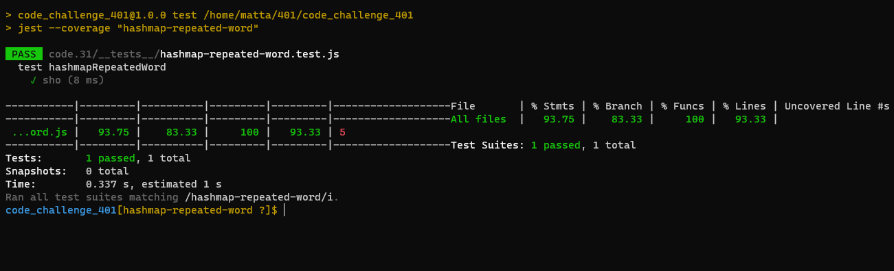

# storefront

## [Phase 1](https://wizih.csb.app/)

## [Phase 12](https://jwf73.csb.app/)

### branch name : `redux`

## [Phase 2]()

### branch name : `combined-reducers`

 
 

## UML

> 

## npm start

> npm start  
> Runs the app in the >>>> http://localhost:3000

 

## test

> npm test

> 
